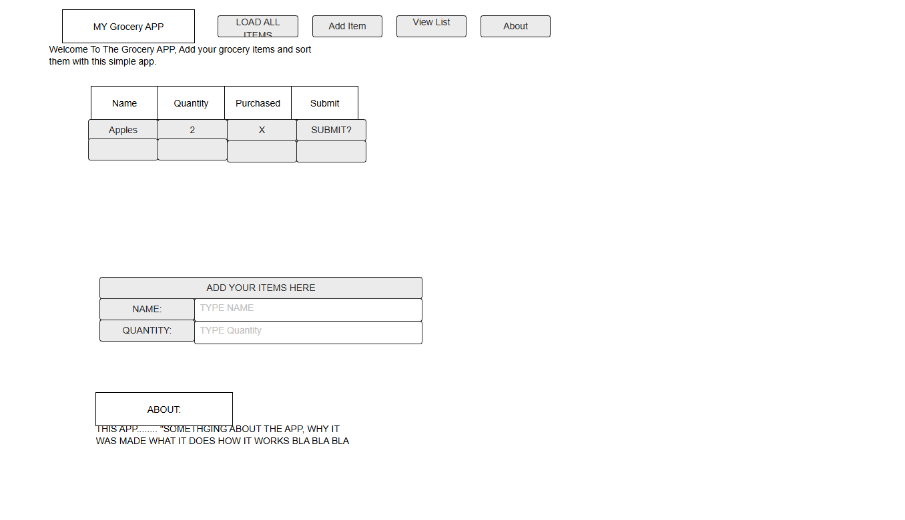

# Web Dev Starter Code
By:Tristin Watkins

## Project Spec

Grocery List App "Like he described in the instructuions LOL"

General Theme:
The Grocery List App is a full-stack web application that allows users to create, view, and manage their grocery shopping lists online.
The application focuses on simplicity, accessibility, and reliability—built entirely from scratch using vanilla HTML, CSS, and JavaScript on the frontend, and AWS services on the backend. I plan to make this app provide an easy and efficient way to track what groceries are needed, mark items as purchased, and delete items once they’re no longer needed.

What It Will Do:
the Grocery List App enables users to
-Add new grocery items through a web form (e.g., “Milk,” “Eggs,” “Bananas”).
-View all existing grocery list items stored in a database.
-Mark items as “Purchased” by checking a box next to each entry.
-Delete items individually when they’re no longer needed.
-Filter or Search for items (for example, show only “unpurchased” items).

Each list item will include:
-id (auto-generated)
-name (string)
-quantity (optional integer)
-purchased (boolean)
-created_at (timestamp)

All data is saved in AWS through API Gateway and Lambda functions.

Target Audience:
This app is designed for everyday users—students, families, and anyone who wants a convenient way to manage grocery lists digitally.
Because the UI is simple, it’s also suitable for classroom demonstrations, senior users, or anyone new to web applications.
It demonstrates core full-stack skills while being accessible on both desktop and mobile browsers.

Data Managed:
-Dynamic data managed by the app:
-Grocery items (name, quantity, purchased, timestamp)
-User-submitted form input
-Conditional views (filtering purchased vs. unpurchased items)
-Static assets include:
-CSS stylesheets
-Simple logos or icons
-HTML structure and JavaScript files
-No sensitive user data (like accounts or payments) is collected—only grocery list entries stored per user session.
-Technical Stack

Summary:
The Grocery List App is a complete full-stack solution showcasing AWS Lambda, API Gateway, and DynamoDB integration, alongside custom front-end development using vanilla HTML, CSS, and JavaScript.
It fulfills all requirements for an A-grade project: multiple pages, dynamic CRUD functionality, strong accessibility, input sanitization, and test coverage.

## Project Wireframe

TODO: Replace the wireframe below with you own design.

## Current Progress (Check-In 1)

- Basic project structure created (index.html, style.css, main.js)
- Landing page scaffolding completed
- Initial form added for submitting grocery items
- Placeholder JavaScript events added
- CSS structure + styling started will add more later on!
- AWS backend planned but not yet implemented
Overall good start to project, need to make sure everything is working by check point 2. But for now its OK
